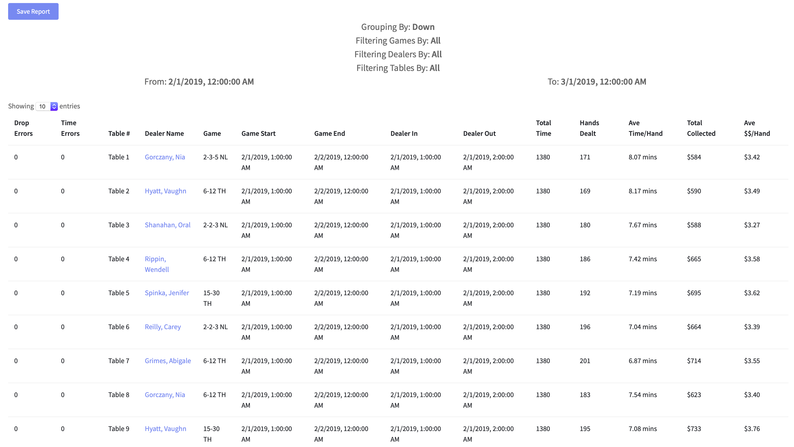
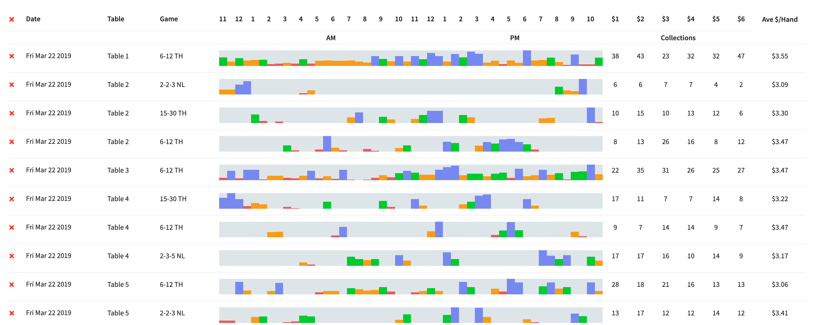

# paged-table

> A simple way to display data on a table.

[](https://www.npmjs.com/package/paged-table) [](https://standardjs.com)


## Whats possible



## Install

```bash
npm install --save paged-table
```

## Basic Usage

```tsx
import * as React from 'react'

import SimpleTable from 'paged-table'

class Example extends React.Component {
  columns = [{ key: "id", displayName: "User Id", headerStyle: { width: '10px' }, sortable: false },
  { key: "name", displayName: "Name" },
  { key: "status", displayName: "Status" },
  {
    key: "createdOn", displayName: "Created On", formatter: (value) => {
      return value.toLocaleString()
    }
  }]

  data = [{id: 1, name: 'Nicholas Mata', status: 'Active', createdOn: new Date()}, 
         {id: 2, name: 'Jane Doe', status: 'Active', createdOn: new Date()}]

  render () {
    return (
      <SimpleTable
        clickable
        bordered
        columns={this.columns}
        data={this.data}
      />
    )
  }
}
```


## Advanced Usage
Coming Soon - Look at example for now.

## License

MIT © [NicholasMata](https://github.com/NicholasMata)
